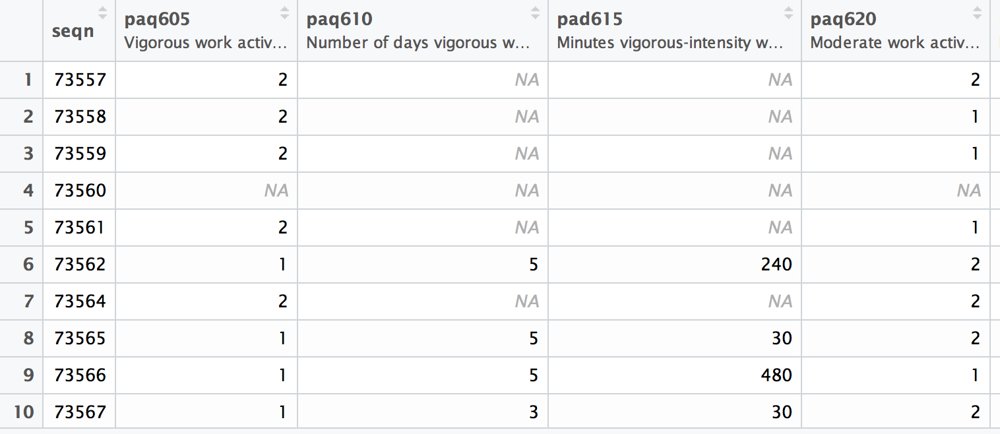

# NHANES Data Discovery

Unfortunately, finding and downloading survey data in the proper format is one of the more time-consuming parts of the analysis. However, like other parts of the data analysis process, it's a **skill to develop**.

In this activity, you'll practice **finding and exploring** the most recent publicly available data from the National Health and Nutrition Examination Survey (NHANES). In particular, you'll want to find the **data and codebooks** for the **demographics** of each participant, as well as the **physical activity** survey responses.

## Instructions
Your goal is to find the most recent publicly available data from the NHANES study and load it into R. The final product will look like this:

In order to do so, you'll need to do the following:

1. Create a `data/` folder in this repository (`nhanes`). Inside your `data` folder, create `raw/` and `prepped/` sub-folders.

2. Identify the most recent release of  NHANES physical activity data on the [CDC website](https://www.cdc.gov/nchs/nhanes/).

3. Find the descriptions of each question related to physical activity.

4. Download the **physical activity** data in the available format into your `data/raw` folder.

5. Create an R file `data-prep.R`, and figure out how to read the available file format into R.

6. Unfortunately, this file doesn't have the **demographic information** for each participant (most importantly, **survey weights**). Find the demographic information from each participant, and download it as well.

7. In your `prep-data.R` file, load both the demographic data and physical activity data into R, and merge them together using participant information.

8. Once you have your dataset merged (and otherwise formatted as you see fit), write the combined file into your `data/prepped` directory for further analysis (to be continued).
